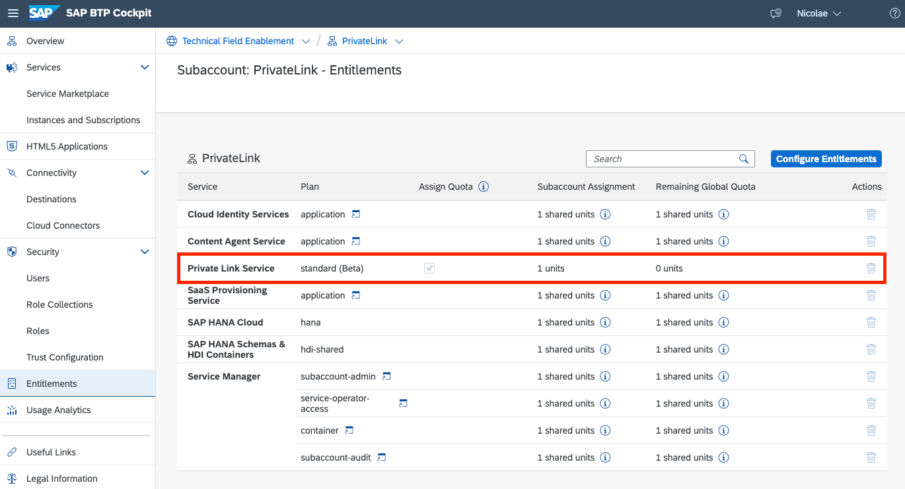
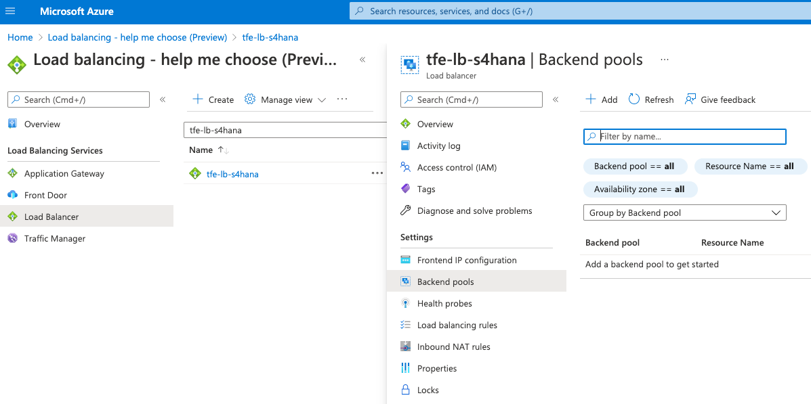
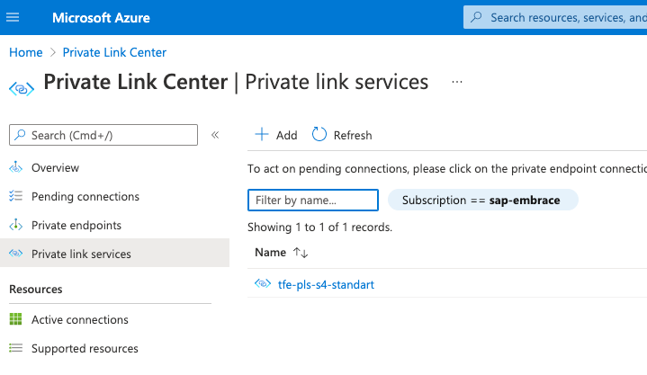
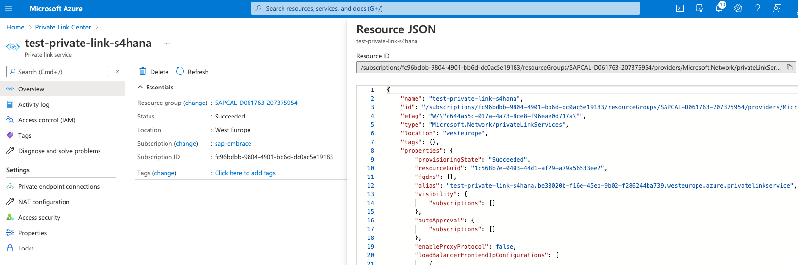
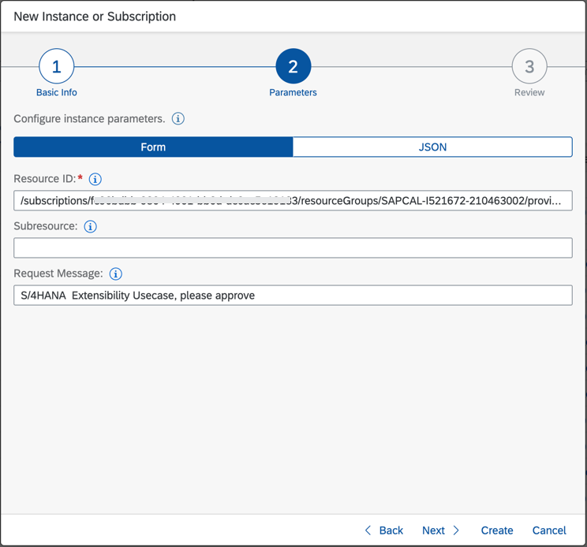
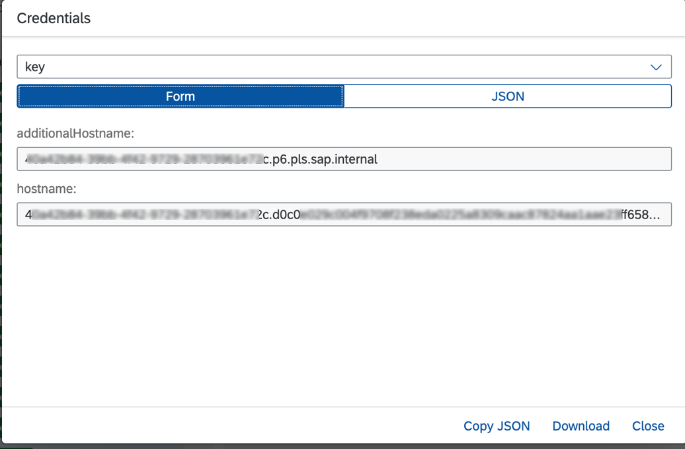
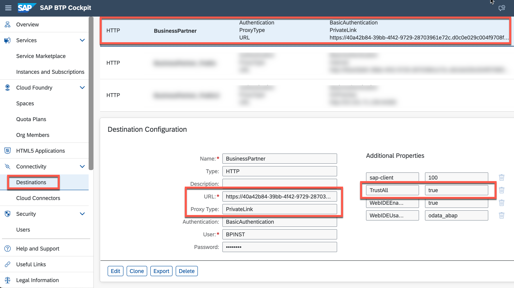

# SAP S/4HANA Extension over SAP Private Link (BETA) service to Azure

In this section you can find all required steps for your Extension Application to use the SAP Private Link (BETA) Service to consume OData resources from S/4HANA system located on **Azure** subscription. 
More details about [SAP Private Link Service ](https://blogs.sap.com/2021/06/28/sap-private-link-service-beta-is-available/).

In our use case we are going to use the SAP Private Link service to communicate with an SAP S/4HANA system (or other SAP or non-SAP system running on a VM in your own Azure account) privately from within the SAP BTP, Cloud Foundry Runtime without SAP Cloud Connector.

Using the SAP Private Link (BETA) service will not require the SAP Cloud Connector anymore to expose the systems and communication through  the internet, the entire traffic is secured by internal hyperscaler network without any exposure. 

The current use case is describing an SAP S/4HANA extension application, of course having an S/4HANA solution deployed on Azure infrastructure.

## Architecture Description

With the SAP Private Link service, applications running on SAP BTP, Cloud Foundryr runtime with Microsoft Azure as IaaS provider can communicate with Azure Private Link services via a private connection. 
This ensures that traffic is not routed through the public internet but stays within the Azure infrastructure.

This connection can be established by creating an Azure Private Link service that exposes a load balancer which routes traffic to the SAP S/4HANA system. This Azure Private Link service must then be used as the resource to which the SAP Private Link service connects to. As soon as the connection is established successfully, the SAP Private Link service provides private DNS hostnames pointing to the Azure Private Link service.


## Set Up SAP Private Link Service on BTP

The Enhanced BETA version of Private link service is available on SAP BTP accounts running on Azure and should be enabled under your SAP BTP subaccount.

To be able to use the functionalities of SAP Private Link service, you first need to set the entitlements in your subaccount.
On <code>SAP BTP Cockpit -> Entitlements</code>, the <code>Private Link Service</code> should be configured.




## Azure Private Link Service

The Azure Private Link Service can only be created by using an Azure Load Balancer. 

**Very Important**:  [Azure Private Link Service is only supported on Standard Load Balancer.](https://docs.microsoft.com/en-gb/azure/private-link/private-link-service-overview#properties)

### Creation of Azure Load Balancer

Fill in the below properties with your values. Keep the following properties unchanged:
- Type: Internal
- SKU: Standard


Once created open the created resource. Go to <code>Settings -> Health probes</code> and create health probes records by clicking the <code>+ Add</code> button.


For S/4HANA VM as health probe will serve port 22.


Now it's time to add Virtual Machines which will serve the load coming to current load balancer.

Under the created load balancer, navigate to <code>Settings -> Backend pools</code>, a pool of virtual machines should be added
by clicking the <code>+ Add</code> button. 



**Very Important**:  If Virtual Machine which is supposed to be added into the pool do have associated a Public IP,
then the Public IP should have the Standard SKU. Usually VMs created using the SAP Cloud Appliance Library do have Public IP on Basic SKU. In this case, change it to Standard SKU.

Make sure that a pool has been created and Virtual Machine has been added.


Under the <code>Settings -> Load balancing rules</code>, records should be added
by clicking the <code>+ Add</code> button. Two rules should be created with the same port and backend port 50000 & 44300 
that were earlier used to create the pool and health probe, as reference:


Subsequently, the status can be checked navigating to <code>Monitoring ->Insights</code>. Make sure the status is green. 


### Creation of Azure Private Link Service

A private link service is required in order to have a private link as endpoint. 

Navigate to <code>Private Link Center -> Private link services</code> and create a new one by clicking the <code>+ Add</code> button. 



Provide the **Basics** information as follows:


Fill in the **Outbound** information, by selecting the earlier created load balancer:


**Very Important**:  Enable TCP V2 option should be on "No". 

At the end of wizard click on <code>Create</code> button.


Once create the private link service click on it and look for <code>JSON View</code> link and click on it.



Collect the resource id.

## Create the SAP Private Link Instance

Since you have already instantiated the Azure Private Link Service and collected the Resource ID, you can now create the SAP Private Link instance on SAP BTP.

Navigate to the SAP BTP Cockpit, select your subaccount and go to <code>Instances and Subscriptions</code>. Select <code>Create</code>.


Select the <code>Private Link Service</code> from the list of services and provide an instance name.


Continue with <code>Next ></code>.

Enter the Azure Private Link Service Resource ID for **Resource ID**. Additionally, enter a **Request Message** which is then displayed to the approver in the Azure Portal.



Trigger the creation via <code>Create</code>.

A new instance of the SAP Private Link (BETA) service with status <code>Creation in Progress</code> will appear in the list of SAP BTP service instances.


In order to change the status to <code>Created</code>, an operation on the Azure portal is required.

Navigate to the Azure Portal and go to <code>Private Link Center -> Pending connections</code>. A new waiting connection in status **Awaiting approval** should appear. If not, refresh the list. 


Once the pending connection is displayed, select it and continue with <code>Approve</code> and select <code>Yes</code>. 
After some time the record will disappear from the list and is now considered as approved.

Go back to the SAP BTP Cockpit. The SAP Private Link (BETA) service instance should now be in status <code>Created</code>.


After the succesful service instance creation, you can now select the created service instance and inspect the credentials. There you can find the generated set of private DNS hostnames which will be used in the upcomming steps for the private communication. 



 > Although the Private Link Service is a private tunnel, it is common to use Transport Layer Security (TLS) for security between applications. Private DNS hostname will allow issuing certificates based on an actual hostname for the connected resource and enables TLS connections with verified hostnames.

## Prepare Extension Application based on CAP (SAP Cloud Application Programming Model) for PrivateLink communication

There are a couple of steps required to enable the Private Link connection in the CAP application used in this scenario. 

### Adapt Destination for PrivateLink Service - Configure the "BusinessPartner" destination

 * Open your SAP BTP Account and navigate to your subaccount
 * Go to **Connectivity -> Destinations** in the menu on the left
 * Modify the existing *BusinessPartner* destination:
 Instead of using the ProxyType **On-Premise** for Cloud Connector connectivity, SAP introduced a new ProxyType called **PrivateLink**. Choose that ProxyType and enter the Private Link hostname from the credentials section of the previous step. 

 Finally add **TrustAll=true** in the additional properties of the destination. **(We will change this property in later steps)**.

 > Note: If TrustAll is set to TRUE in the destination, the server certificate will not be checked for SSL connections. It is intended for test scenarios only, and should not be used in production (the server certificate will not be checked and you will not notice MITM attacks). 

Find an example of the destination configuration below:



### Destination config
Property | Value |
--- | --- |
Name | BusinessPartner |
Tyoe | HTTP |
URL | https://40a42b84-39bb-xxx-9729-287xxxxe72c.d0c0e029c004f9xxxx8eda0225a83xxxxxxaae23ff65b.p6.pls.sap.internal (replace with your PrivateLink hostname) |
Proxy Type | PrivateLink |
Authentication | BasicAuthentication |
User | <<  username >> |
Password | <<  password >> |

### Additional Properties
Property | Value |
--- | --- |
sap-client | 400 (or the client you want to connect to) |
TrustAll | true  (should not be used in production) |
HTML5.DynamicDestination | true |
WebIDEEnabled | true |
WebIDEUsage | odata_abap |

>Note: Not all SDK/Libraries are suppoprting the ProxyType: PrivateLink yet. For those cases use proxy type Internet instead.

### Bind application to Private Link service

Open the MTA deployment descriptor and add following PrivateLink resource to your MTA and assign it to *BusinessPartnerVerification-srv*

```json

modules:
  - name: BusinessPartnerVerification-srv
    type: nodejs
    path: gen/srv
    requires:
      - name: BusinessPartnerVerification-pl
      - ...

...

resources:
  # PrivateLink Service
  - name: BusinessPartnerVerification-pl
    type: org.cloudfoundry.existing-service
    parameters:
      service: privatelink 
      service-name: private-link-s4hana # change to your instance name
      service-plan: standard

```

### Redeploy the Application and Test it

Build the Multi-Target Application Archive (MTA Archive) by executing the following command in the root directory of your project in the terminal:

  ```
  mbt build -e trial.mtaext
  ```

This will produce a .mtar file in the mta_archives directory. Some of the values for the service instance creation depend on the environment you are deploying to, that's why the *-e* for *extension* is used here. 

Deploy the application to SAP BTP, Cloud Foundry Runtime by executing the following command in the root directory of your project in the terminal:

  ```
  cf deploy mta_archives/BusinessPartnerVerification_1.2.0.mtar
  ```

This will trigger the deployment to SAP BTP, Cloud Foundry Runtime including the creation of the necessary service instances and service bindings to the corresponding services like PrivateLink. 

Try the application by creating new or modifiying Business Partners as described [here](https://github.com/SAP-samples/s4hana-btp-extension-devops/tree/mission/08-TestApplication#test-basic-scenario-end-to-end).


## Coming soon: setup end-to-end SSL

Instead of ignoring the server certificates by the destination property **TrustALL**, for **Productive** scenarios you can upload the server certificate of the HTTPS server (in this case S/4HANA) to the Trust Store of the Destination Service. This will be coming soon. 
