# Approve/Reject a Business Partner using SAP Workflow Management

## Description

In this step, you are going to use SAP Workflow Management to enhance the already existing CAP application. The SAP Fiori Elements UI to the already existing CAP application offers two buttons to block or unblock a Business Partner in the SAP S/4HANA on-premise system. Once these buttons are pressed, a new workflow instance in SAP Workflow Management is triggered and sent to the person in charge for this Business Partner. To find out who is responsible for this business partner, the Business Rules capability of SAP Workflow Management is used. 

## Setup SAP Workflow Management

#### Prepare your SAP Business Technology Platform Enterprise Account
1. Navigate to **Boosters** in the SAP BTP Cockpit.
  
  
2. Search for **Workflow Management** and select **Start**.
  

3. Select the subaccount, Cloud Foundry org and space in which you want to setup SAP Worfklow Management. Select **Finish**.
  

4. This will result in the below Progress.
  
  
5. After the Booster completes, select **Navigate to Subaccount**. 
  > For Further Details of setup Refer this [Blog](https://blogs.sap.com/2020/07/19/automatically-setup-workflow-management-in-sap-cloud-platform-using-booster/)

6. With this, you are going to subscribe to SAP Workflow Management. Furthermore, the required service instances and destinations are created as well as the needed Role Collections will be assigned to your user.

#### Importing the business rules project

1. Fork and clone the repository into SAP Business Application Studio.
```
https://github.com/SAP-samples/btp-build-resilient-apps.git
```
then 
```
cd btp-build-resilient-apps
git checkout workflow_module
```
 
2. Please find the Business Rules Project in the **BusinessRulesProjects** directory and **download** it. (Right-Click on the directory name to get the option to download the entire directory)
   

3. Navigate to **Instances and Subscriptions** in the SAP BTP cockpit and open **workflow management**.
  

3. Select the  **Manage Rule Projects** tile as part of the **Developement Tools** section in the SAP Workflow Management launchpad.
  

4. Click on the **Import project** icon.
  

5. Select the directory that you have recently downloaded.
  

6. This will result in the following screen.
  

7. Click on the project and navigate to Data Objects.
  
  
8. Click on **BusinessPartnerAdress** as one of the Local Data Objects.
  

9. **Edit** the Local Data Object.
  

10. **Activate** it.
  

11. The status should be now be **Active**.
  
  
12. Repeat the process for the Local Data Objects **Approvers** to also activate it.

13. Navigate to the **Rules** tab. 
  

14. Select **DetermineApproversRule**.

15. Then click on **Edit**.

16. Update the decision table for this sample use case: Enter your own mail adress  that you are using for SAP BTP for the Local Manager ID into the decision table, so that you are responsible for Business Partners in the respective countries. 
  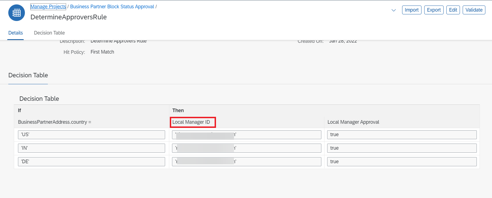

17. **Activate** the changes.
  

18. Navigate back to the Business Rules project and open the **Rule Services** tab.
  

19. Click on **Edit** and **Activate** the Rule Service. 
  

20. Navigate to **Rulesets** in project and **Activate the rule sets**.

21. Navigate to **RuleServices** once again and **Deploy** them.
  
  
22. In **Manage Rules Project**, click on **Release Version** fill the details as below and click **Release**.
  

23. Follow [Testing Business Rules](https://developers.sap.com/tutorials/cp-cf-businessrules09-test-apis.html) to test your deployed Business Rules.

#### Deploying Workflow Project
 
1. Go back to your workflow project in the **SAP Business Application Studio**. Right-Click on the **mta.yaml** file and select **Build MTA Project**.
  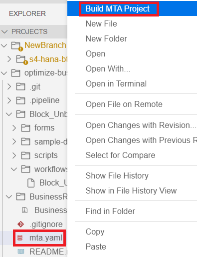

2. Navigate to **mta_archives** and deploy the produced MTA Archive file.
  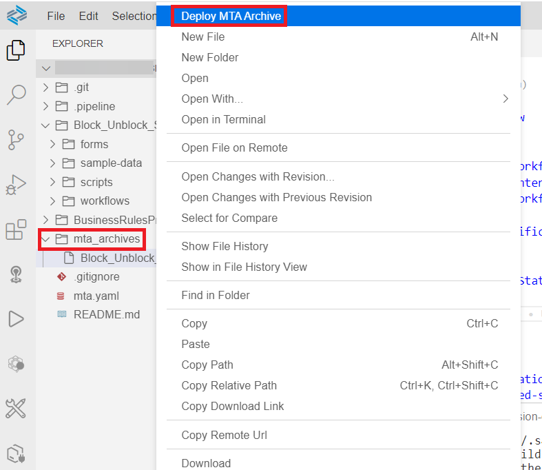

3. Follow the Deployment progress in the terminal. Your workflow is now being deployed. 

#### Testing the deployed workflow

1. Navigate to **Instances and Subscriptions** and click on **Workflow Management**
  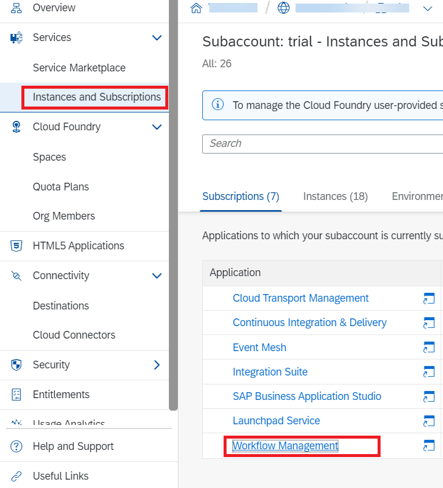

2. Navigate to the **Monitoring Tools** tab and select the **Monitor Workflows - Workflow Definitions** tile.
  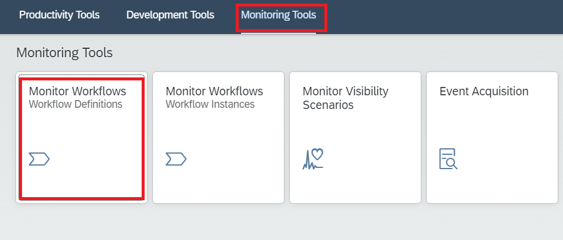

3. If everything went right during the deployment process, you should see the below entry. If you don't see any workflow definition, go back to your SAP Business Application Studio and check the terminal output for error messages. 
   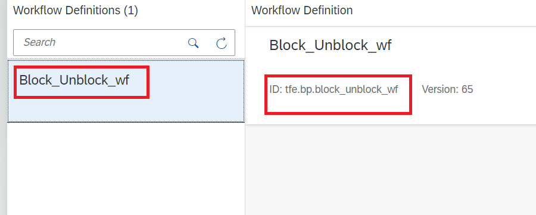

4. click on **Start New Instance**. 
  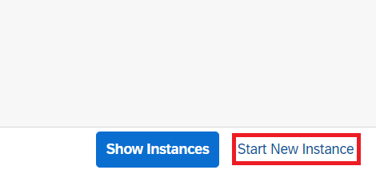

5. Click on **Start New Instance and Close**. This will create a new instance of the workflow definition and actualls *runs* the workflow with a sample context that is shown in the same form.
  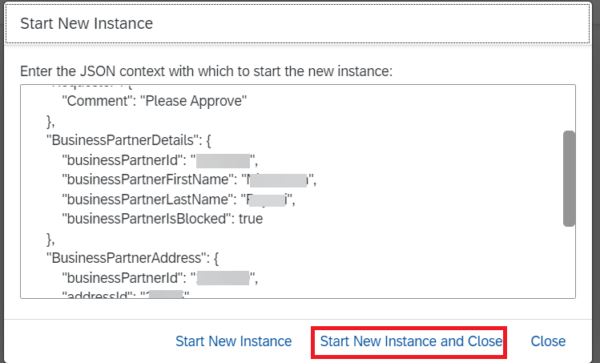

6. Navigate back to home page and select **My Inbox** in **Productivity Tools**.
  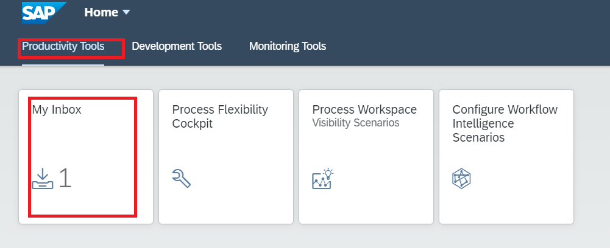

7. There is a new task assigned to you. That happened because the workflow instance was looking up the responsible manager for this Business Partner using the Business Rules project you have deployed earlier. Since you have entered your mail adress the **responsible Local Manager ID**, the task has now been assigned to your user.

Select **Approve or Reject**. This will successfully complete the workflow.
  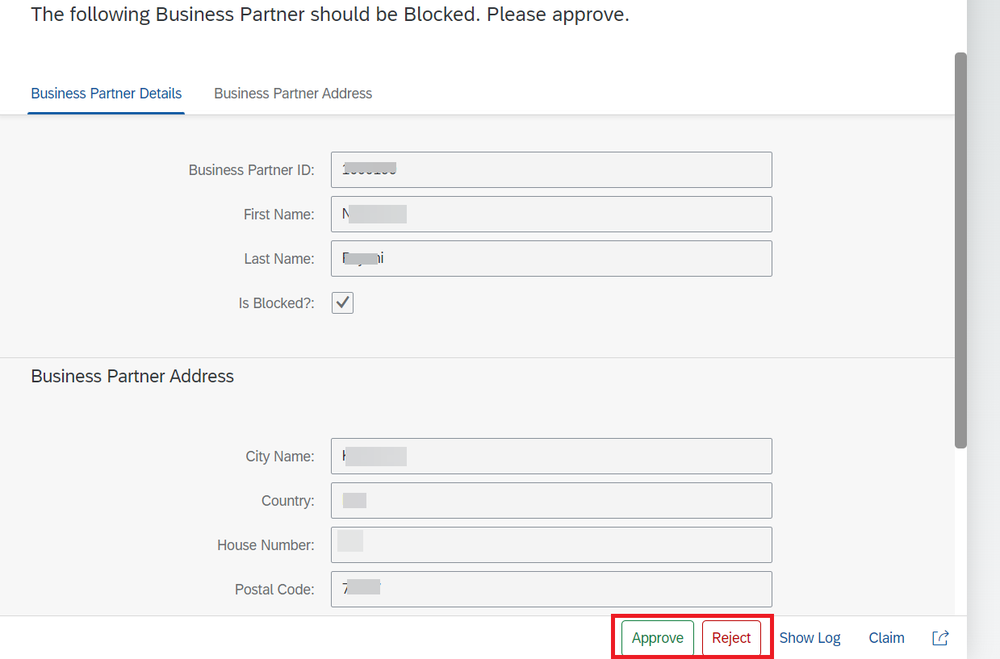

8. Click on **Workflow Instances** in **Monitoring Tools**.
  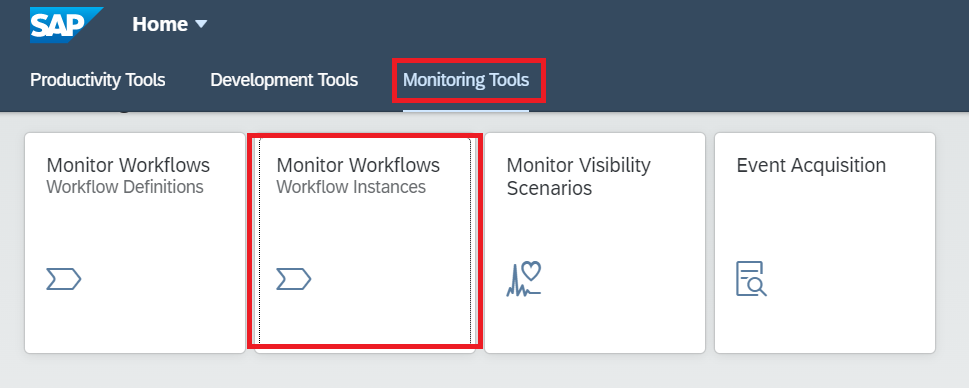

9. The Instance will be completed successfully.
  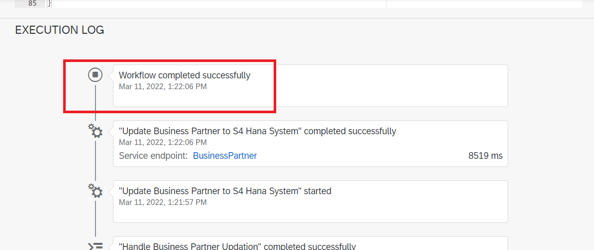


#### Set up CICD pipeline and github webhook

1. Please follow the steps in this tutorial to [configure the SAP Continious Integration & Delivery service](https://developers.sap.com/tutorials/btp-app-ci-cd-btp.html). You should only the first steps including **Step 5: Configure your SAP BTP credentials**. You don't have to go through all the steps.

2. Click on Repository tab in the SAP Continuous Integration and Delivery, choose **+** to create a new repository connection.
  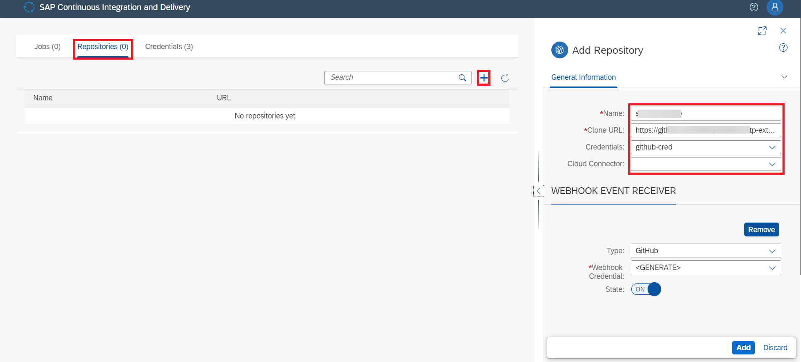

3. Fill in the below details

| Field   |      Value     |
|----------|:-------------:|
| Name | build_resilient_apps_repo |
| Clone URL | https://github.com/YourUser/btp-build-resilient-apps.git |
| Credentials | github-cred |
| Type| GitHub |
| Webhook Credentials| GENERATE |
| State| ON |

> Note: Please remember change **username** in **clone url** to your personal fork. Also **credentials** here refers to the GitHub credentials that you have created within the SAP Continous Integration & Delivery service while following the tutorial to do the basic setup. TODO: Replace GitHub URL.

4. Continue with **Add**.

5. After the repository connection is has been created, open the respository to get the corresponding webhook data that you need to configure the webhook on github.com. Note down the **Payload URL**, **Content type** and **Secret** for later usage.


5. Go to your fork on github.com to add the webhook details. A webhook will call a certain endpoint when events on your repository (in this case the fork of the original repository) happens. 

6. Navigate to **Settings** on the top menu. 
  

7. Click on **Webhooks** and **Add webhook**.
  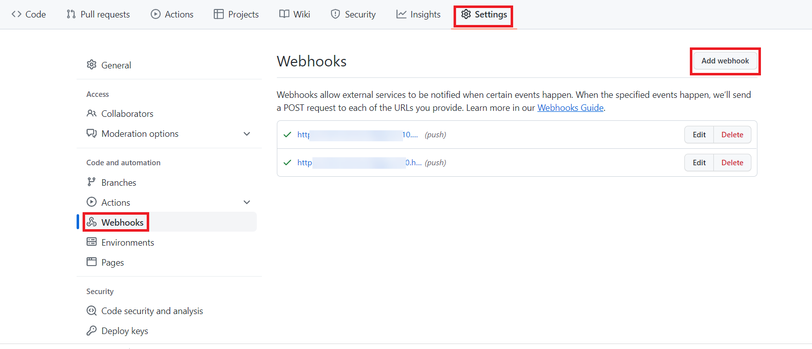

8. Fill the Payload URL, Content type and secret details that you have received previously from the SAP Continous Integration & Delivery service. Leave everything else as it is and finish the webhook creation with **Add webhook**.
  . 

9. In the **Jobs** tab in the SAP Continuous Integration and Delivery service, choose **+** to create a new job.
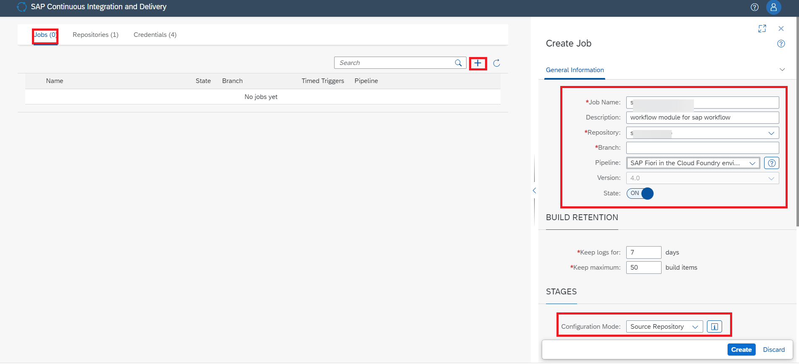

10. Please fill the below details:

| Field   |      Value     |
|----------|:-------------:|
| Job Name |  workflow_definition_mta |
| description | Workflow Definition MTA to Block/unblock Business Partner in S/4HANA   |
| repository| build_resilient_apps_repo |
| Branch| workflow_module |
| Pipeline| SAP Fiori in CLoud foundry environment |
| State| ON |
| Configuration Mode| Source Repository |

11. **Create** the job.

12. Go back to the SAP BTP Business Application Studio once again, where you have cloned your repository fork.

13. Open **config.yml** in the **.pipeline** directory.
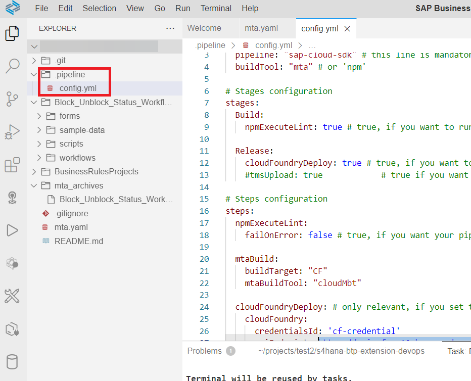

14. Edit the details in the Cloud Foundry deployment section. credentialsId is the Cloud Foundry credentials ID that were configured in SAP Continuous Integration and Delivery service (for instance, the Credentials ID here is cf-credential).
  

15. Enter the API endpoint, Cloud Foundry org and space that can be found in the subaccount overview in the SAP BTP cockpit.
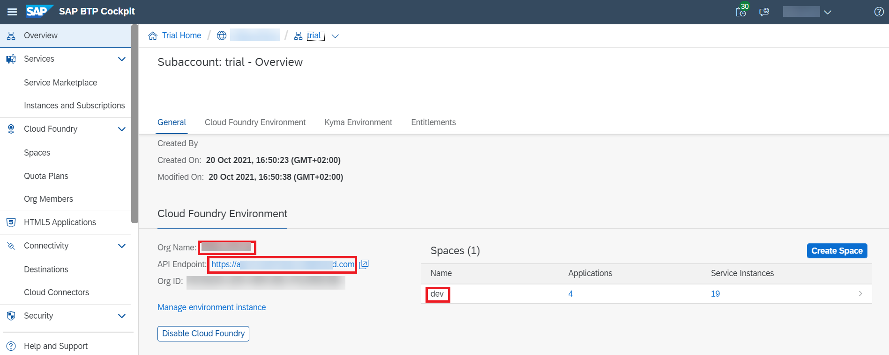

15. Push the code to GitHub - that should also trigger your pipeline. Therefore, execute the following commands: 
```
git add .
git commit -m "push pipeline config"
git push
```
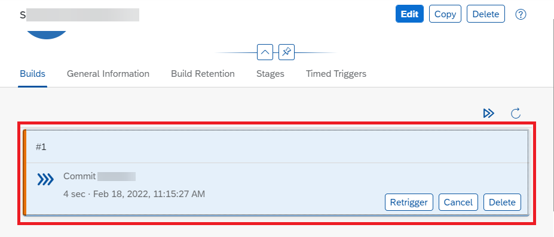

16. It should be completed successfully.


#### Add Destination for CAP application

The CAP application is using the SAP Workflow Management HTTP APIs, that's why a destination in the SAP BTP subaccount is needed.

1.  Go to the SAP BTP cockpit and navigate to **Instances and Subscriptions**.
   
2. Select the **BusinessPartnerVerification-wf** instance.
    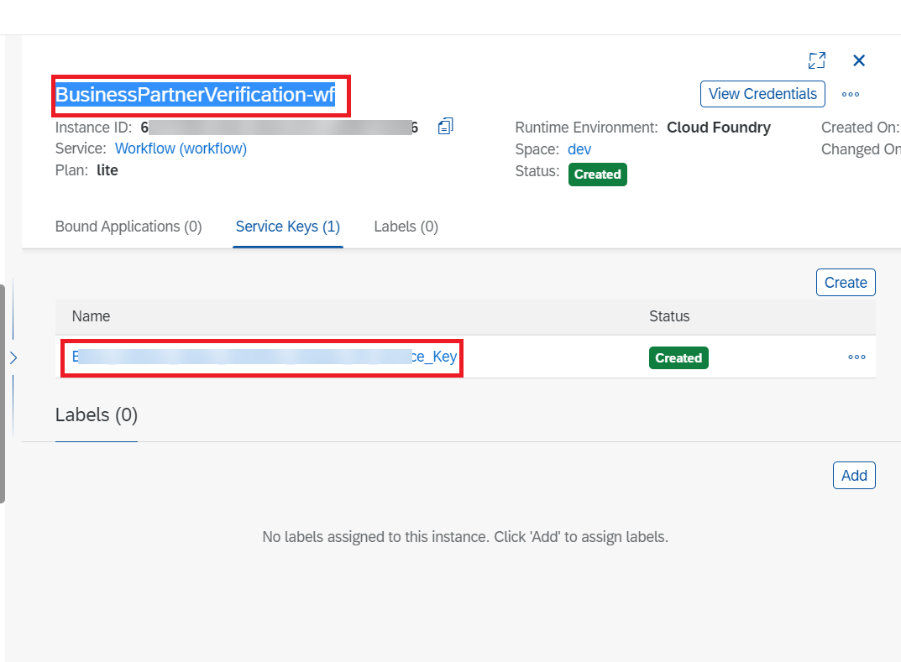

3. Navigate to **Service Keys**, select the existing service key and note down **workflow_rest_url, clientid, clientsecret, url** for the next step.

4. Navigate to **Connectivity -> Destinations** and create a **New Destination**.
    

5. Provide the following details:
    

| Field   |      Value     |
|----------|:-------------:|
| Name |  BlockStatusWfDest |
| Type |  HTTP |
| Description |Block status destination   |
| URL| workflow_rest_url (from step 3) |
| Proxy Type| Internet |
| Authentication | Oauth2ClientCredentials |
| Client ID | clientid (from step 3) |
| Client secret| clientsecret (from step 3) |
| Token Service URL | url (from step 3)+ '/oauth/token' |

> Note: name of destination should be **BlockStatusWfDest** and token service url should have /oauth/token appended e.g. **https://{orgname}.authentication.us10.hana.ondemand.com/oauth/token**

6. Click **save**
